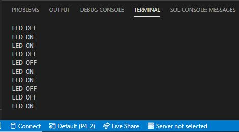

# PRACTICA 4_2  : Sistemas Operativos En Tiempo Real

## 1.Salida Del Terminal



## 2.Codigo

```

#include <Arduino.h>

/* this function will be invoked when additionalTask was created */

const int led1 = 2; // Pin of the LED
SemaphoreHandle_t xBinarySemaphore; // Tipo que simula el semáforo

void toggleONLED( void * parameter );
void toggleOFFLED( void * parameter );

void setup(){

  Serial.begin(112500);
  pinMode(led1, OUTPUT);
  xBinarySemaphore = xSemaphoreCreateBinary();
  
  /* we create a new task here */
  xTaskCreate (toggleONLED, /* Task function. */
  "Toggle ONLED", /* name of task. */ 
  1000, /* Stack size of task */
  NULL, /* parameter of the task */
  1, /* priority of the task */
  NULL); /* Task handle to keep track of created task */

  /* we create a new task here */
  xTaskCreate (toggleOFFLED, /* Task function. */
  "Toggle OFFLED", /* name of task. */ 
  1000, /* Stack size of task */
  NULL, /* parameter of the task */
  1, /* priority of the task */
  NULL); /* Task handle to keep track of created task */

  xSemaphoreGive (xBinarySemaphore);

}

/* the forever loop() function is invoked by Arduino ESP32 loopTask */
void loop(){

  delay(1000);

}

void toggleONLED(void * parameter){

  while(1){
    
    xSemaphoreTake(xBinarySemaphore, portMAX_DELAY);
    Serial.println("LED ON");
    digitalWrite(led1, HIGH);
    xSemaphoreGive(xBinarySemaphore);
    vTaskDelay(1000);
        
  }
  
}

void toggleOFFLED(void * parameter){

  while(1){
    
    xSemaphoreTake(xBinarySemaphore, portMAX_DELAY);
    Serial.println("LED OFF");
    digitalWrite(led1, LOW);
    xSemaphoreGive(xBinarySemaphore);
    vTaskDelay(1000);

  }

}

```

## 3.Funcionamiento

Para comenzar, definimos nuestro LED conectado al pin 2 de la ESP32. Luego utilizamos el xSemaphoreCreateBinary (), que se utiliza para crear un semáforo binario.

Posteriormente definimos las cabezeras de nuestras dos tareas, las cuales se encargaran de encender y apagar el LED por separado y sincronizadamente gracias al semáforo que hemos implementado.

En el void setup (), declaramos las instrucciones habituales Serial.begin(112500) y pinMode(led1, OUTPUT). Además, definimos xBinarySemaphore = xSemaphoreCreateBinary() para crear el semáforo, el xSemaphoreGive (xBinarySemaphore), que se utiliza para lanzar semáforos binarios / contadores, y, por último, creamos las tareas toggleONLED y toggleOFFLED.

En el void loop () declaramos un simple delay, y, posteriormente definimos las tareas creadas en el void setup (), donde ejecutaremos funciones como xSemaphoreTake(xBinarySemaphore, portMAX_DELAY), xSemaphoreGive(xBinarySemaphore), las cuales se utilizan para lanzar semáforos binarios / contadores, digitalWrite(led1, HIGH/LOW) para encender o apagar el LED, y, finalmente, vTaskDelay(1000) para programar cuanto tiempo se está ejecutando la tarea.

Así pues, en el instante inicial, “ToggleONLED” comienza a ejecutarse, ya que ambas tareas tienen el mismo nivel de prioridad, y toma una señal de semáforo binaria usando xSemaphoreTake () y completa toda su ejecución. Debido a la técnica de programación de tiempo compartido de FreeRTOS para tareas de igual prioridad, "ToggleOFFLED" intentará ejecutarse adelantándose a "ToggleONLED", pero entra en el estado de bloqueo debido a la no disponibilidad del semáforo binario de recursos compartidos. Por lo tanto, “ToggleONLED” primero completa su ejecución y luego libera el semáforo binario.

Tan pronto como el semáforo binario esté disponible, “ToggleOFFLED” inicia su ejecución porque entra en estado de bloqueo debido a la no disponibilidad del semáforo binario de recursos compartidos. Del mismo modo, también completa su ejecución y libera el token. Después de eso, el código repite el mismo patrón para su ejecución.